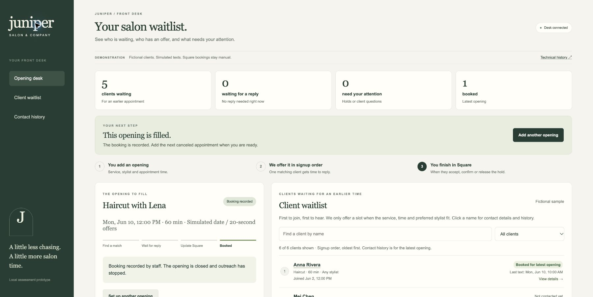

# Juniper Salon — the opening desk

A local prototype built from a 15-turn conversation with Lena. It gives the earliest eligible client an exclusive offer, waits durably for a response, and reserves a hold until Lena or Carla completes the booking in Square.

**Public, independent assessment repository. The application is not deployed. All clients and texts are simulated.**



## Run with one command

Prerequisites: **Node.js 20+**, **Docker Desktop running** (or Docker Engine with Compose), and free local ports **3000, 7233, 8233**. Initial installation needs internet access for npm dependencies and the Temporal image. Verified on macOS / Apple silicon; use a POSIX shell on other systems.

After cloning this repository and entering its directory:

```sh
./run.sh
```

The script installs the locked dependencies on first run and starts Temporal, the Worker, and the API. Open **http://localhost:3000**. Temporal Web UI is at **http://localhost:8233**.

Press Ctrl-C to stop the API and Worker. `npm run stop` stops the local Temporal container; its named Docker volume keeps workflow history. Do not delete the volume if you want to preserve offers or opt-outs.

## A two-minute walkthrough

1. Read the overview: waiting clients, unanswered offers, staff attention, and bookings for the current opening. Click a client name to inspect their phone number, signup date, appointment, preferences, and contact history.
2. Enter the canceled appointment in **Add a canceled appointment**. The waitlist is visible before outreach starts. Keep the prefilled June 10, 2030 date and **Quick demo · 20 seconds** under **Demo settings**. Click **Start offering this opening**.
3. The next-step banner identifies the client with the offer. Click **View current client**, then **Open this client’s demo conversation**. Ask a question or click **Yes, hold this spot**. The simulator also opens from **Test a client reply** below the waitlist.
4. Acceptance changes the banner to **Confirm this booking**. Enter a note such as `Square update simulated by Carla`, check the Square-update confirmation, and click **Record booking**. The client profile now shows when staff recorded the booking and the new appointment time.
5. Create another opening and let the first offer expire. In the simulator, select Anna’s old offer and try replying: the server rejects it. The next matching client has the current offer.
6. In **Demo settings**, try **First client's message fails** or **First delivery recovers after a retry**. Contact history shows the outcome.

The waitlist is sorted by signup order. Search and filters let staff find clients who are still waiting, already contacted, or booked for this opening. A mismatch explains the actual reason, such as **Wants Carla · this slot is with Lena**. The waiting count includes clients without texting permission, whose rows clearly say **Do not contact**.

To repeat while an offer or hold is active, **Withdraw opening**, then **Set up another opening**. A client opting out stays opted out in this durable desk across future openings. Opt-out does not cancel a held or booked appointment.

**Standard mode** uses real time and 15-minute offers. Both modes enforce 9 am–7 pm contact hours and an offer deadline at least 30 minutes before the appointment. Quick demo uses a simulated 10 am salon clock and 20-second timers; no accelerated result represents a real business improvement. Los Angeles is the prototype timezone assumption, not a customer-confirmed salon location.

## What Lena asked for

See [the complete interview](evidence/customer-interview.txt) and [her scope confirmation](evidence/customer-confirmation.jpg).

- Earliest joined first, after matching service, duration, stylist preference, availability, and contact permission (turns 2, 13).
- One exclusive 15-minute offer, avoiding conflicting booking promises (turns 3–4).
- Acceptance creates a hold; staff manually update Square, then confirm or explicitly release it (turns 5–6, 14).
- Decline, timeout, or delivery failure advances automatically. Questions need staff attention without pausing the timer. Stop requests suppress future outreach (turns 7, 11–12).
- Staff see the opening, current client, deadline, and earlier outcomes (turn 8).
- Contact hours and arrival buffer were proposed and explicitly approved (turn 14).

Lena estimates **8–12 cancellations inside 48 hours each week**, with **about 3 refilled**. Her goal is **at least half refilled without repeatedly checking**. These are customer estimates and a goal, not measured prototype outcomes.

## How Temporal is used

The browser calls a local Express API. The API sends **Updates** to a long-running `salonDesk` Workflow and uses a **Query** to read its state. The Workflow owns the current opening, offers, absolute deadlines, holds, opt-outs, and activity journal. It does not rely on browser timers or API memory for booking decisions.

- `condition` with a timeout creates a durable Temporal timer. Expiration is also checked when acceptance arrives, so a delayed timer callback cannot make a stale offer valid.
- Synchronous Update handlers serialize state transitions. The offer ID must still be current, and only one active opening/offer/hold is allowed.
- The browser supplies a request ID, used as Temporal's Update ID for safe retries after uncertain network outcomes. Repeated acceptance does not create a second hold.
- `deliverOffer` is an Activity with bounded retries: 5-second attempt timeout, 15-second total timeout, and at most 3 attempts. The simulated `retry` scenario fails once; the `failed` scenario advances without leaving the opening stuck.
- Delivery completion checks that the offer is still current. A staff withdrawal during a retry cannot resurrect the offer.
- Temporal's SQLite development database is stored in a named Docker volume. Restarting the Worker replays recorded decisions and retains the original deadline.

**Why the Temporal workflow stays RUNNING after a booking:** it represents the front desk, not a single appointment. A booking closes that opening; the same durable desk remains ready for the next one and remembers opt-outs. The screen shows the latest opening; older transitions remain in Temporal history. Production would add Continue-As-New and an archival/read model before history grows large.

## Verify

```sh
npm run typecheck
npm test
```

The tests use Temporal's time-skipping test server and do not require Docker. The first run may download the test server. They cover eligibility, contact/arrival boundaries, duplicate acceptance, expired responses, questions without deadline extension, explicit booking confirmation, release, retries, failure, withdrawal, durable opt-outs, and an empty eligible list.

With the local Temporal service running:

```sh
node scripts/verify-recovery.mjs
node scripts/verify-api.mjs
```

The recovery script creates an **isolated** workflow and Worker, kills only that child Worker with SIGKILL, restarts it, and asserts an identical offer ID/deadline plus successful acceptance. It terminates its own test workflow afterward; that TERMINATED status is intentional cleanup, not an application failure. It writes `evidence/worker-recovery.json`.

## Evidence and presentation

- [Temporal Web UI screenshot](evidence/temporal-workflow.jpg)
- [Verified Worker recovery](evidence/worker-recovery.json)
- [Verification notes](evidence/verification.md)
- [Four standalone PDF slides](presentation/juniper-salon.pdf)
- [Editable slide source](presentation/juniper-salon.pptx)

## Deliberate prototype boundaries

- One active opening at a time; a fixed fictional waitlist is seeded for each opening. Phone numbers, signup dates, and existing Square appointments in client profiles are fictional demo data. Contact and booking timestamps reflect this workflow’s recorded actions. The profile history covers the current opening only. Live intake, spreadsheet import, multi-opening scheduling, and cross-opening conflicts are excluded.
- No actual SMS or Square API calls. The client preview is a simulator inside the staff page, not a secure client portal. Real provider idempotency, delivery webhooks, consent records, and reconciliation are needed before sending messages.
- A staff confirmation is an assertion that Square was updated. The prototype cannot detect a booking made independently in Square; staff must withdraw that opening manually. Existing later appointments are never edited here.
- Staff must personally contact clients when releasing or withdrawing a hold. No real outbound confirmation is sent.
- No staff authentication or authorization. API and Docker ports are bound to loopback; this is for local evaluation only.
- The display keeps the latest opening and its last 200 journal entries. Operational reporting, production monitoring, retention policies, and Continue-As-New are future work.
- No automatic overnight resumption: outside the agreed contact/arrival boundaries, outreach stops with a staff-visible explanation.

## Practical next step

After integrating messaging, waitlist intake, staff sign-in, and Square reconciliation, Lena and Carla could supervise a two-week pilot. Measure confirmed refills divided by eligible openings, staff follow-ups per opening, and conflicting booking promises. Compare with her baseline; aim for at least 50% refilled and zero conflicts before widening use.

Built from the provided [Temporal assessment starter](https://github.com/john-b-yang/temporal-waitlist-assessment-starter), cloned into a new repository rather than forked. SDK reference: [Temporal TypeScript guide](https://docs.temporal.io/develop/typescript).
